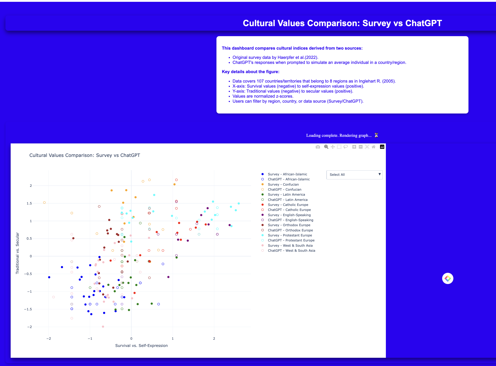
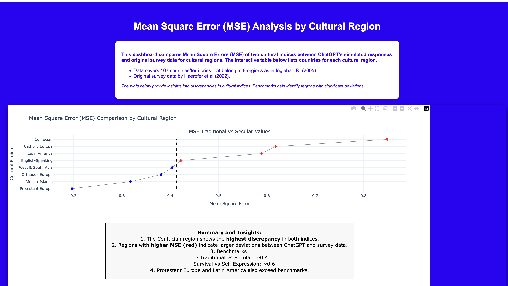
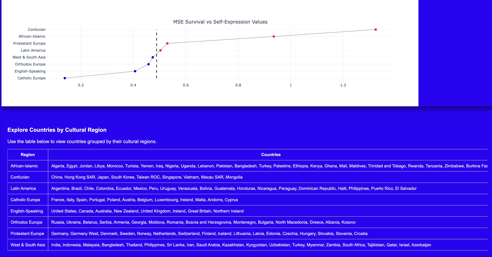
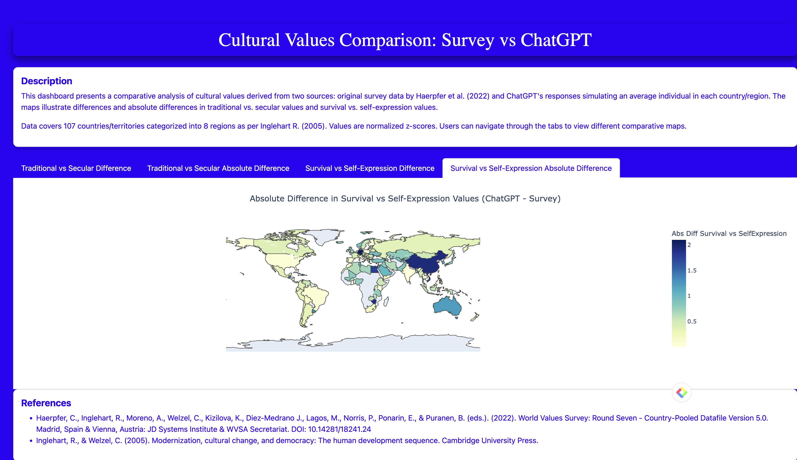

# **EthosGPT: Charting the Human Values Landscape on a Global Scale**

---

  <h2 style="color: #333;">📚 Table of Contents</h2>
  <ul style="list-style: none; padding: 0; font-size: 18px;">
    <li style="margin: 10px 0;">
      <a href="#project-overview" style="text-decoration: none; color: #007acc; font-weight: bold;">
        📖 Project Overview
      </a>
    </li>
    <li style="margin: 10px 0;">
      <a href="#global-representation-of-diversity" style="text-decoration: none; color: #007acc; font-weight: bold;">
        🌍 Global Representation of Diversity
      </a>
    </li>
    <li style="margin: 10px 0;">
      <a href="#key-features-and-core-components" style="text-decoration: none; color: #007acc; font-weight: bold;">
        ✨ Key Features and Core Components
      </a>
      <ul style="list-style: none; padding: 0; margin: 10px 20px;">
        <li style="margin: 5px 0;">
          <a href="#multidimensional-value-mapping" style="text-decoration: none; color: #007acc;">
            🗺️ Multidimensional Value Mapping
          </a>
        </li>
        <li style="margin: 5px 0;">
          <a href="#prompt-based-evaluation" style="text-decoration: none; color: #007acc;">
            🔍 Prompt-Based Evaluation
          </a>
        </li>
        <li style="margin: 5px 0;">
          <a href="#interactive-data-tools" style="text-decoration: none; color: #007acc;">
            📊 Interactive Data Tools
          </a>
        </li>
      </ul>
    </li>
    <li style="margin: 10px 0;">
      <a href="#why-ethosgpt" style="text-decoration: none; color: #007acc; font-weight: bold;">
        🌟 Why EthosGPT?
      </a>
    </li>
    <li style="margin: 10px 0;">
      <a href="#how-it-works" style="text-decoration: none; color: #007acc; font-weight: bold;">
        🔍 How It Works
      </a>
    </li>
    <li style="margin: 10px 0;">
      <a href="#references" style="text-decoration: none; color: #007acc; font-weight: bold;">
        📚 References
      </a>
    </li>
  </ul>

---

## Project Overview

  <h2>🌍 Background and Motivation</h2>

  <!-- What is EthosGPT -->
  <h3>🔎 What is EthosGPT?</h3>
  

    Large language models (LLMs) are transforming global decision-making and societal systems. Their ability to process diverse data and align with human values is both a <b>remarkable strength</b> and a <b>critical risk</b>.  
    While LLMs excel at navigating cultural, economic, and political differences, they also risk homogenizing values—a process akin to the loss of biodiversity threatening ecological resilience. <a href="#footnote-3">[3]</a> <a href="#footnote-4">[4]</a>

  

  <!-- Why Value Diversity Matters -->
  <h3>🌟 Why Value Diversity Matters</h3>
  <blockquote>
    

      <b>“Diversity is the foundation of innovation, adaptability, and resilience.”</b> 
      – <a href="https://www.unesco.org/en/cultural-diversity" target="_blank">UNESCO</a>
    

  </blockquote>
  

    Just as ecosystems thrive on biodiversity, societies prosper through the rich interplay of varied human value systems. Without this diversity:
  

  <ul>
    <li>🛑 <b>Risks:</b> Homogenization could lead to ethical oversights and stagnation in AI-driven decision-making.</li>
    <li>💡 <b>Opportunities:</b> Preserving cultural values ensures sustainable progress, fostering ethical and inclusive AI innovation.</li>
  </ul>

  <!-- Vision of EthosGPT -->
  <h3>✨ The Vision of EthosGPT</h3>
  

    EthosGPT introduces an <b>open-source framework</b> designed to <b>map and visualize LLMs’ positioning</b> within a multidimensional landscape of human values. Using <i>prompt-based evaluation</i>, EthosGPT examines how effectively AI systems navigate complex global differences in human values.
  

  <ul>
    <li>📈 <b>Strengths:</b> Insights into LLMs’ cultural adaptability.</li>
    <li>🔍 <b>Limitations:</b> Identification of ethical dilemmas where LLMs struggle with nuanced, context-specific scenarios.</li>
  </ul>
  

    EthosGPT bridges disciplines by offering <b>open-source data, code, and interactive tools</b>, inviting global audiences to enhance and engage with its findings.
  

  <!-- Commitment to Diversity -->
  <h3>🌐 Our Commitment to Diversity and Inclusion</h3>
  

    At EthosGPT, we are dedicated to including as many human cultural heritages as possible in our open-source framework. Our goal is to support the 
    <b>sustainable development of humanity</b>, ensuring AI systems are <b>inclusive, representative, and ethically aligned</b>.
  

---

  <h2>🎨 A Global Representation of Diversity</h2>
  
Below is a sketch of flags from <b>107 countries</b>, grouped by <b>8 cultural regions</b>, reflecting the diversity of nations covered in EthosGPT.

<!-- Flags Section -->

  <table>
    <thead>
      <tr>
        <th>African-Islamic</th>
        <th>Confucian</th>
        <th>Latin America</th>
        <th>Catholic Europe</th>
        <th>English-Speaking</th>
        <th>Orthodox Europe</th>
        <th>Protestant Europe</th>
        <th>West & South Asia</th>
      </tr>
    </thead>
    <tbody>
      <tr>
        <!-- African-Islamic Flags -->
        <td>
           
           
           
           
          
          ...
        </td>
        <!-- Confucian Flags -->
        <td>
           
           
           
           
          
          ...
        </td>
        <!-- Latin America Flags -->
        <td>
           
           
           
           
          
          ...
        </td>
        <!-- Catholic Europe Flags -->
        <td>
           
           
           
           
          
          ...
        </td>
        <!-- English-Speaking Flags -->
        <td>
           
           
           
           
          
          ...
        </td>
        <!-- Orthodox Europe Flags -->
        <td>
           
           
           
           
          
          ...
        </td>
        <!-- Protestant Europe Flags -->
        <td>
           
           
           
           
          
          ...
        </td>
        <!-- West & South Asia Flags -->
        <td>
           
           
           
           
          
          ...
        </td>
      </tr>
    </tbody>
  </table>

---

## **Key Features and Core Components**

### 🗺️ **Multidimensional Value Mapping**
- Visualize LLM performance across cultural and ethical dimensions using comparative analyses of survey data and ChatGPT outputs. <a href="#footnote-5">[5]</a> <a href="#footnote-6">[6]</a>.**

> **Example 1: Analyze cultural values through indices**  
> - **Traditional vs Secular-Rational Values**: A scale measuring the emphasis on tradition and authority versus secular and rational perspectives.  
> - **Survival vs Self-Expression Values**: A scale reflecting the shift from survival priorities to self-expression and quality-of-life concerns.

> **Example 2: Explore region-based discrepancies**  
> - Data normalized into z-scores for **107 countries/territories**, grouped into **8 cultural regions**:  
>   - **Regions include:** Confucian, Protestant Europe, Latin America, African-Islamic, etc.  
> - **Insights:**  
>   - The **Confucian region** exhibits the **highest discrepancies** in both indices.  
>   - **Protestant Europe and Latin America** exceed benchmarks for alignment differences.

---

### 🔍 **Prompt-Based Evaluation**
- Assess LLMs using structured prompts simulating responses of an "average individual" from specific countries or regions.

> **Example 1: Comparison with survey data**  
> - Compare ChatGPT's simulated cultural indices against **original survey data** (Haerpfer et al., 2022).  
> - **Strength:** Consistent alignment in secular-rational values for **English-Speaking regions** (e.g., USA, UK).  
> - **Weakness:** Underrepresentation of **self-expression values** in **African-Islamic regions** (e.g., Egypt, Morocco).

> **Example 2: Evaluate discrepancies using MSE analysis**  
> - **Mean Square Error (MSE)** identifies regions with significant deviations.  
> - **Benchmarks:**  
>   - Traditional vs Secular: ~0.4  
>   - Survival vs Self-Expression: ~0.6  
> - **Insights:**  
>   - Regions with **higher MSE (e.g., Confucian regions)** indicate larger deviations between ChatGPT predictions and survey data.

---

### 📊 **Interactive Data Tools**
- Analyze LLM outputs with advanced tools that foster cross-domain collaboration.
- Explore cultural diversity, alignment metrics, and biases via open-source visualizations.

  <table style="border-collapse: collapse; width: 80%; background-color: #f9f9f9; box-shadow: 0 4px 8px rgba(0, 0, 0, 0.1); border: 1px solid #ddd;">
    <tr style="border-bottom: 1px solid #ddd;">
      <td align="center" style="padding: 20px;">
        

          
        

         
        <strong>Interactive Visualization Demo 1</strong>
      </td>
      <td align="center" style="padding: 20px;">
        

          
        

         
        <strong>Interactive Visualization Demo 2.1</strong>
      </td>
    </tr>
    <tr>
      <td align="center" style="padding: 20px;">
        

          
        

         
        <strong>Interactive Visualization Demo 2.2</strong>
      </td>
      <td align="center" style="padding: 20px;">
        

          
        

         
        <strong>Interactive Visualization Demo 3</strong>
      </td>
    </tr>
  </table>

---

### 📊 **Interactive Data Tools**

  <table>
    <thead>
      <tr>
        <th>🖼️ Visualization</th>
        <th>📋 Description</th>
        <th>📘 Learning Opportunities</th>
        <th>🌐 Webpage</th>
        <th>💻 Source Code</th>
      </tr>
    </thead>
    <tbody>
      <tr>
        <td><strong>🌍 Cultural Values Comparison: Survey vs ChatGPT</strong></td>
        <td>Compare cultural value indices derived from human survey data with ChatGPT-generated responses.</td>
        <td>
          <ul>
            <li>🔎 Examine ChatGPT's alignment with cultural dimensions like individualism and power distance.</li>
            <li>⚖️ Identify biases in AI outputs compared to human data.</li>
          </ul>
        </td>
        <td><a href="https://cultural-indices-dashboard.onrender.com/" target="_blank">🌐 Open App</a></td>
        <td><a href="https://github.com/sunshineluyao/cultural-indices-dashboard" target="_blank">💻 GitHub Repo</a></td>
      </tr>
      <tr>
        <td><strong>📊 Mean Square Error (MSE) Analysis by Region</strong></td>
        <td>Analyze the accuracy of ChatGPT’s cultural value predictions using MSE metrics.</td>
        <td>
          <ul>
            <li>📈 Assess regional accuracy and identify areas for improvement.</li>
            <li>🌍 Compare ChatGPT's cultural representations across regions.</li>
          </ul>
        </td>
        <td><a href="https://culture-indices-mse.onrender.com/" target="_blank">🌐 Open App</a></td>
        <td><a href="https://github.com/sunshineluyao/culture-indices-mse" target="_blank">💻 GitHub Repo</a></td>
      </tr>
      <tr>
        <td><strong>🗺️ Cultural Values Map</strong></td>
        <td>Explore cultural value indices on an interactive global map.</td>
        <td>
          <ul>
            <li>🗺️ Gain a visual understanding of global cultural indices.</li>
            <li>🔍 Compare ChatGPT's outputs with survey data across nations.</li>
          </ul>
        </td>
        <td><a href="https://culture-indices-map.onrender.com/" target="_blank">🌐 Open App</a></td>
        <td><a href="https://github.com/sunshineluyao/culture-indices-map" target="_blank">💻 GitHub Repo</a></td>
      </tr>
    </tbody>
  </table>

---

## **Why EthosGPT?**

### 🌍 **Preserving Cultural Diversity**

  <blockquote>
    

      LLMs often risk homogenizing values, reflecting dominant cultural biases and marginalizing underrepresented perspectives.
    

  </blockquote>
  <table>
    <tr>
      <td>🌟</td>
      <td><b>Highlight Diversity:</b> EthosGPT emphasizes the preservation of <b>cultural diversity</b>, enabling AI systems to adapt to and celebrate the rich tapestry of global values.</td>
    </tr>
    <tr>
      <td>🔓</td>
      <td><b>Open-Source Contribution:</b> By offering an <b>open-source framework</b>, EthosGPT invites global contributions to ensure cultural inclusivity and representation.</td>
    </tr>
  </table>

---

### ⚖️ **Advancing Ethical AI Alignment**

  <blockquote>
    

      Provides actionable insights for developing AI systems that are socially and ethically aligned, ensuring context-aware decision-making.
    

  </blockquote>
  <table>
    <tr>
      <td>✅</td>
      <td><b>Context-Aware Decision-Making:</b> Addresses nuanced ethical dilemmas faced by AI in diverse cultural contexts.</td>
    </tr>
    <tr>
      <td>📊</td>
      <td><b>Bias Mitigation:</b> Leverages <b>interactive tools and visualizations</b> to identify and reduce biases in AI systems.</td>
    </tr>
  </table>

---

### 🔓 **Open-Source and Research-Driven**

### 🔓 **Open-Source and Research-Driven**

  <blockquote>
    

      Built on a research-backed foundation, EthosGPT combines open-source tools and rigorous cultural analysis to drive innovation and inclusivity.
    

  </blockquote>
  <table>
    <tr>
      <td>📚</td>
      <td>
        <b>Research-Backed:</b> Studies like <a href="#footnote-1">CVALUES</a> and <a href="#footnote-2">CultureLLM</a> provide robust foundations for culturally sensitive AI analysis.
      </td>
    </tr>
    <tr>
      <td>🌐</td>
      <td><b>Collaboration:</b> EthosGPT offers <b>open-source data, code, and tools</b>, empowering researchers, developers, and policymakers worldwide.</td>
    </tr>
    <tr>
      <td>🔍</td>
      <td><b>Cross-Disciplinary Exploration:</b> Breaks traditional boundaries between AI, ethics, and cultural studies for innovative solutions.</td>
    </tr>
  </table>

## **How It Works**

1. **Prompt Input**  
   Carefully crafted prompts probe LLM responses across cultural and ethical contexts.

2. **Response Evaluation**  
   Alignment is measured using frameworks like Hofstede’s cultural dimensions.

3. **Visualization**  
   Results are displayed through intuitive visualizations to highlight strengths and biases.

---

## References

1.  Xu, G., Liu, J., Yan, M., et al. (2023). CVALUES: Measuring the Values of Chinese Large Language Models from Safety to Responsibility. [arXiv:2307.09705v1](https://arxiv.org/abs/2307.09705).
2.  Li, C., Chen, M., Wang, J., et al. (2024). CultureLLM: Incorporating Cultural Differences into Large Language Models. [arXiv:2402.10946v2](https://arxiv.org/abs/2402.10946).
3.  Kharchenko, J., Roosta, T., Chadha, A., & Shah, C. (2024). How Well Do LLMs Represent Values Across Cultures? [arXiv:2406.14805v1](https://arxiv.org/abs/2406.14805).
4.  Tao, Y., Viberg, O., Baker, R. S., & Kizilcec, R. F. (2024). Cultural Bias and Cultural Alignment of Large Language Models. [DOI:10.1093/pnasnexus/pgae346](https://doi.org/10.1093/pnasnexus/pgae346).
5. Haerpfer, C., Inglehart, R., Moreno, A., Welzel, C., Kizilova, K., Diez-Medrano J., M. Lagos, P. Norris, E. Ponarin & B. Puranen (eds.). (2022). World Values Survey: Round Seven - Country-Pooled Datafile Version 5.0. Madrid, Spain & Vienna, Austria: JD Systems Institute & WVSA Secretariat. [DOI:10.14281/18241.24](https://doi.org/10.14281/18241.24).
6. Inglehart, R., Welzel, C. (2005). Modernization, cultural change, and democracy: the human development sequence. Vol. 333. Cambridge University Press.

